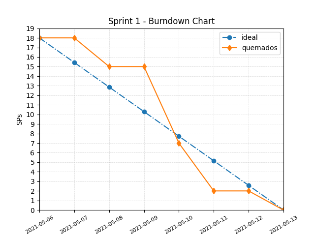
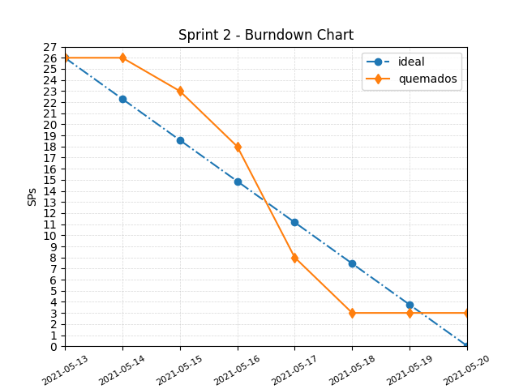

# github-simple-burndown-chart

Simple script to generate a scrum burndown chart based on story points.

#### You need

* Labels to identify the SP with format: `# SP`
  * 1 SP
  * 2 SP
  * 3 SP
  * 5 SP
  * 8 SP
  * 13 SP
  * etc
* Milestones to represent sprints with **due date**
* Issues **in** each sprint with the SP label according to the stimation

See labels, milestones and issues in this project as example.

#### Note

This script was made for educational purposes only.
It can certainly be improved.

